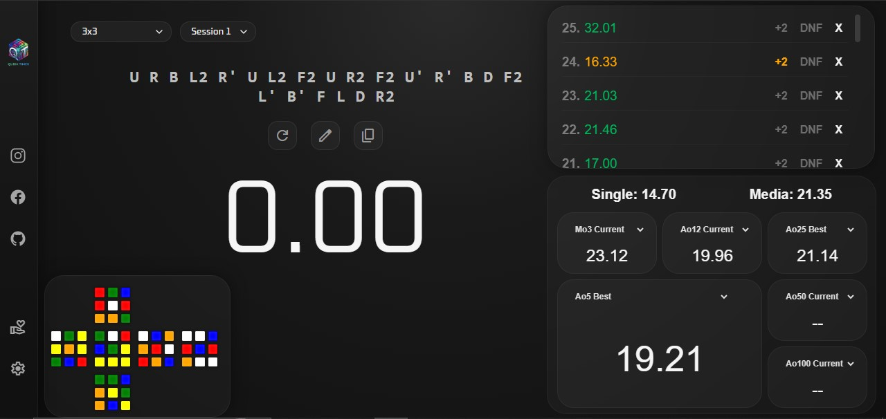

# Qubik Timer - Professional Speedcubing Timer

  

## Project Access

The platform is centralized through its official production channel to guarantee a unique, stable, and reliable practice environment:

**Main Version:** https://qubiktimer.com

This version is synchronized directly with the repository's main release branch. It provides the definitive production environment, fully tested and optimized for end users.

Qubik Timer is a high-performance web application designed for formal speedcubing practice under conditions equivalent to official competition environments. Developed with an *offline-first* approach, the platform replicates the workflow regulated by the World Cube Association (WCA), integrating valid scramble generation, controlled time measurement, and a real-time statistical analytics engine.

---

## Interface Preview

  

---

## Main Features

The system simulates the physical behavior of a Rubik's Cube through indexed structures and deterministic state transformations, eliminating the need for external graphics engines in order to ensure maximum performance and complete control over the logical state.

* **3x3 Logical Simulation:** 2D rendering from the official fixed perspective (White on top, Green in front), mathematically synchronized in real time with all applied moves.

  
* **Competitive Scrambles:** Proprietary algorithm that generates sequences of 20 to 23 moves while restricting algebraically reducible patterns (such as $RR$ or $LLL$) to ensure clean and competition-grade scrambles.

  
* **Precision Timer:** Keyboard activation system that emulates tournament timers, requiring the spacebar to be held for 300 ms to reduce accidental starts.

  
* **Penalty Management (+2 / DNF):** Structured support for official penalties, accessible directly from the times table or through a detailed inspection panel (*overlay*).

---

## Official Statistical Analysis

The statistical engine evaluates user performance by applying the mathematical rules used in official competitions, processing data directly from IndexedDB to avoid temporary frontend states.

* **Standard Metrics:** Automated tracking of Single (best absolute time, excluding DNF) and Global Mean across all stored solves.

  
* **Rolling Averages:** Exact calculation of Mo3, Ao5, Ao12, Ao25, Ao50, and Ao100 using official extreme-removal algorithms (best and worst times according to the metric).

* **Dynamic DNF Limits:** Accumulative DNF tolerance based on the total number of solves. The system scales these limits through cumulative blocks once 100 solves are exceeded, invalidating averages strictly when the allowed quota is surpassed.

  
* **History (Current vs. Best):** Persistent selector synchronized with `promDB` that allows switching between the current average (last X solves) and the best historical average recorded.

---

## Current Status and Upcoming Updates

The project has successfully completed its primary development phase and is **officially available to the public**. The current desktop version features a fully stable mathematical core, a robust data persistence system, and fully operational statistical panels.

Development efforts are currently focused on the deployment of the following priority updates:

* **Mobile Web Support:** Optimization and implementation of a responsive interface specifically adapted for mobile devices and touchscreens.

  
* **Category Expansion:** Technical integration and support for additional puzzle events beyond the standard 3x3 cube.

  
* **Advanced Analytics:** Development of graphical visualization tools for performance tracking and long-term progress analysis.

---

## Author

Developed by **Eloxb Developer**:

* **Qubik Instagram:** [@qubik.timer](https://www.instagram.com/qubik.timer)
* **Eloxb Instagram:** [@develoxb](https://www.instagram.com/develoxb)
* **GitHub:** [@Eloxbdeveloper](https://github.com/Eloxbdeveloper)

---

Designed as a technical tool for competitive training and performance analysis in Speedcubing.

